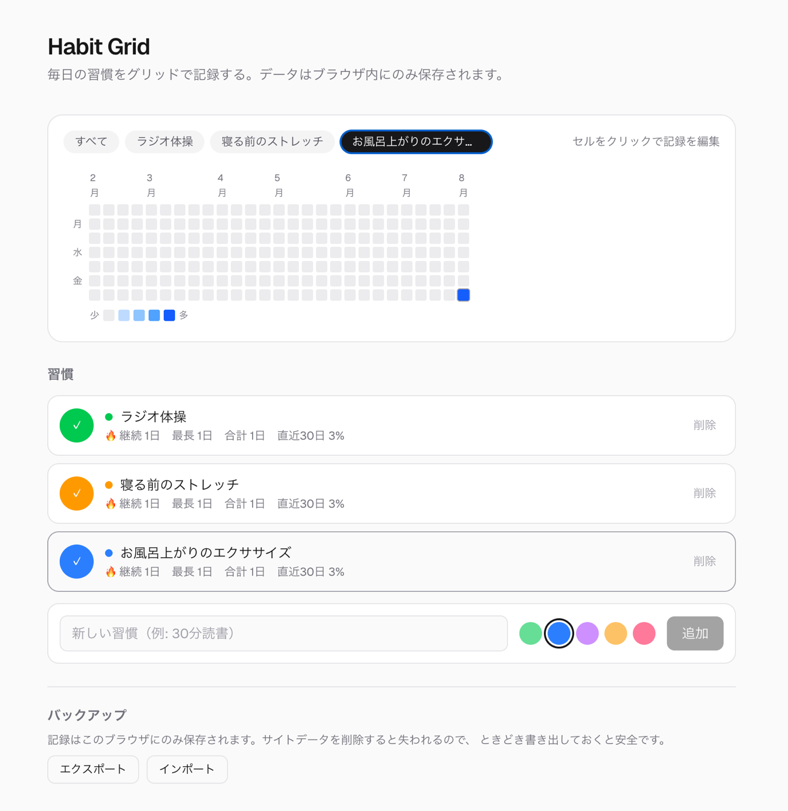

# Habit Grid

[](https://github.com/yuko0209/habit-grid/actions/workflows/ci.yml)

毎日の習慣を GitHub の contribution graph 風のグリッドで記録するトラッカー。
データはブラウザの `localStorage` にのみ保存されます。AIの「今日のひとこと」機能を使ったときだけ、集計値（習慣名・継続日数・達成率）がAPIに送信されます。

**デモ: https://habit-grid-9yb4.vercel.app**
アカウント登録は不要です。開いてすぐ試せます。



## 開発背景

習慣を続けるには「積み上がりが見えること」が効くと感じていた一方、既存のアプリには
気になる点がありました。

- 続くか分からない習慣のために、アカウント登録と個人情報の提供を求められる
- 記録がサービス側にあるため、サービスが終われば記録も消える

そこで **「アカウント不要・データは手元・記録は自分で持ち出せる」** を方針に据え、
バックエンドを持たない構成で作りました。サーバーに送らないと決めたことで認証も DB も
不要になり、代わりに「データを失わせない仕組み」に設計の重心を移しています。

技術面では、Next.js 16 / React 19 の前提（Server Components、`useSyncExternalStore`）を
実際に動くプロダクトで使い切ることを目的に置きました。

## 機能

- 習慣の追加・削除（名前 + 5 色から選択）
- 今日の達成をワンクリックで記録／取り消し
- 過去 27 週間のヒートマップ
  - 「すべて」タブ: その日に達成した習慣の割合を 5 段階の濃さで表示（閲覧のみ）
  - 習慣ごとのタブ: セルをクリックして過去の記録を後から編集できる
- 継続日数（現在／最長）、合計日数、直近 30 日の達成率
- 今月のランキング（達成日数／継続日数で並び替え、同率対応、先月比の増減つき）
- JSON でのエクスポート／インポート（バックアップ・端末移行用）
- PWA 対応（ホーム画面に追加してスタンドアロン起動）

## 開発

```bash
pnpm install
pnpm dev      # http://localhost:3000
pnpm test     # vitest
pnpm lint
pnpm build
pnpm icons    # アイコン PNG を再生成（scripts/generate-icons.mjs）
```

詳しい設計の経緯・注意点・今後のアイデアは [docs/overview.md](docs/overview.md) にまとめてあります。

## 構成

| パス | 役割 |
| --- | --- |
| `app/page.tsx` | Server Component。ページの外枠のみ |
| `app/components/HabitApp.tsx` | 状態を束ねるクライアントのルート |
| `app/components/HabitGrid.tsx` | ヒートマップの描画 |
| `app/lib/date.ts` | `YYYY-MM-DD` キーとグリッド生成（すべてローカル時刻） |
| `app/lib/habits.ts` | 習慣モデルと継続日数などの純粋なロジック |
| `app/lib/storage.ts` | `localStorage` の読み書きと入力値の検証 |
| `app/lib/habit-store.ts` | `useSyncExternalStore` による localStorage の購読 |
| `app/lib/clock.ts` | 「今日」の外部ストア。深夜 0 時とタブ復帰で更新 |
| `app/lib/ranking.ts` | 月次の順位付けと先月比（保存はせず記録から算出） |
| `app/lib/backup.ts` | JSON の書き出し・読み込み |
| `scripts/generate-icons.mjs` | アイコン PNG の生成（依存ライブラリなし） |

### 設計メモ

- 日付はすべて**ローカル時刻**の `YYYY-MM-DD` 文字列で扱う。`toISOString()` は UTC に変換され
  日本時間では日付がずれるため使わない。
- `localStorage` は外部ストアとして `useSyncExternalStore` で読む。effect で state に写して
  いないので、初回ロード時の再レンダリングのカスケードが発生しない。
- 「今日」はクライアントの時計に依存するため、hydration が完了するまで `null` にして
  サーバー／クライアントの不一致を避けている。
- 保存データはユーザーが編集できるので、読み込み時に形式を検証し不正な値は捨てる。
  インポートしたファイルも同じ検証を通す。
- 「今日」はタイマーだけに頼らない。スリープ中は `setTimeout` が発火しないことがあるため、
  タブが再表示されたときにも時計を読み直す。
- localStorage はオリジンごとに分かれるので、`localhost` と本番 URL で記録は共有されない。
  端末やドメインをまたぐときはエクスポート／インポートを使う。
- AIによる「今日のひとこと」機能のみ例外で、習慣名・継続日数・達成率の集計値をGroq API（無料枠、
  入力・出力を学習に利用しない方針）に送信する。ボタンを押したときのみ送信され、日付ごとの記録は送らない。

## 苦労した点・工夫した点

### 1. 日付が 1 日ずれる問題を、設計で封じた

**課題**: 日付を `Date.toISOString()` から作ると UTC に変換されます。JST は UTC+9 なので、
**朝 9 時より前は UTC ではまだ前日**です。毎朝チェックを付けるアプリでこれをやると、
前日の欄に記録されてしまいます。

**対応**: 日付をすべて「ローカル時刻の `YYYY-MM-DD` 文字列」で扱うと決め、生成・比較・
加算のすべてを `app/lib/date.ts` に集約しました。アプリ側では `Date` を直接触りません。

**判断の根拠**: この種のバグは「気をつける」では防げず、再発したときに原因の特定が
難しい種類のものです。そのため規約ではなく、通り道を 1 本にする形で構造的に防ぎました。
実際、テストのコメントに誤った説明（「夜にずれる」）を書いていたことに後から気づき、
朝 8 時のケースを検証するテストに差し替えています。

### 2. localStorage を React に持ち込む方法を、lint 違反をきっかけに設計し直した

**課題**: 当初は `useEffect` で localStorage を読み `setState` する実装でしたが、
Next.js 16 の lint（`react-hooks/set-state-in-effect`）でエラーになりました。
effect 内での同期的な `setState` は再レンダリングのカスケードを生むためです。

**対応**: localStorage は React の状態ではなく「外部システム」だと捉え直し、
`useSyncExternalStore` で購読する形に変更しました。結果として、読み込み用・保存用の
effect が両方とも不要になりました。

**判断の根拠**: 単に lint を黙らせるのではなく、警告が指している設計上の問題
（localStorage は React の外にあるという事実）に合わせました。副作用として、
サーバーレンダリング時の値を明示的に定義でき、hydration の扱いも整理されました。

### 3. 「今日」がずれ続ける問題に、2 系統で対処した

**課題**: 「今日」を初回レンダリング時に一度だけ計算していたため、タブを開いたまま
日付が変わると、翌日も前日の欄にチェックが入る状態になりました。

**対応**: 「今日」も外部ストア（`app/lib/clock.ts`）として実装し、深夜 0 時のタイマーで
更新するようにしました。加えて、**タブが再表示されたタイミングでも時計を読み直します**。
マシンがスリープしているとタイマーが発火しないことがあり、タイマー単独では取りこぼすためです。

**判断の根拠**: 「寝る前に開いて翌朝チェックする」という、このアプリで最も自然な
使い方で確実に踏む不具合でした。フェイクタイマーで深夜ロールオーバーとタブ復帰の
両方をテストしています。

### 4. データが消える経路を洗い出して潰した

**課題**: localStorage だけに保存する構成は、記録が消える経路が複数あります。
ブラウザのサイトデータ削除、端末の変更、そして **localStorage がオリジンごとに
分かれる**という性質（`localhost` と本番 URL で記録が共有されない）です。

**対応**: JSON でのエクスポート／インポートを実装しました。インポートしたファイルは
localStorage から読むときと**同じ検証関数**を通し、壊れたデータや想定外の値は
黙って捨てます（保存データはユーザーが編集できるため）。

**判断の根拠**: バックエンドを持たない選択をした以上、データ保全は機能ではなく
前提条件だと考えました。実際にこの機能があったおかげで、ローカルで試した記録を
本番環境へ移すこともできています。

### 5. 依存を増やさずにアイコンを用意した

**課題**: PWA には複数サイズの PNG アイコンが必要ですが、画像ライブラリを 1 つ入れると
ビルド環境への依存が増え、手で編集できないバイナリ資産もリポジトリに残ります。

**対応**: Node 標準の `zlib` だけで PNG を書き出すスクリプトを書き
（`scripts/generate-icons.mjs`）、アプリのグリッドを模したアイコンを生成しています。
デザインを変えたいときはスクリプトを直して `pnpm icons` を実行します。

**判断の根拠**: 依存を 1 つ増やす判断は、その後ずっと保守コストとして残ります。
今回は「フラットな色の図形を描くだけ」という要件だったため、標準ライブラリで
足りると判断しました。

## テスト方針

112 件のテストは、壊れたときに気づきにくい箇所に集中させています。

| 対象 | 守っているもの |
| --- | --- |
| 日付ロジック | ローカル時刻での日付キー、週境界、未来日の除外 |
| 継続日数 | 今日未チェックでも昨日までの記録は途切れない、という仕様 |
| 保存データの検証 | 壊れた値・不正な色・重複日付を捨てる |
| 時計 | 深夜 0 時のロールオーバー、タブ復帰時の追従（フェイクタイマー） |
| 主要フロー | 追加 → 記録 → 永続化 → 削除、グリッドの編集可否 |
| ランキング | 同率の順位、期間に対する達成率、先月比の増減、月またぎの日付計算 |
