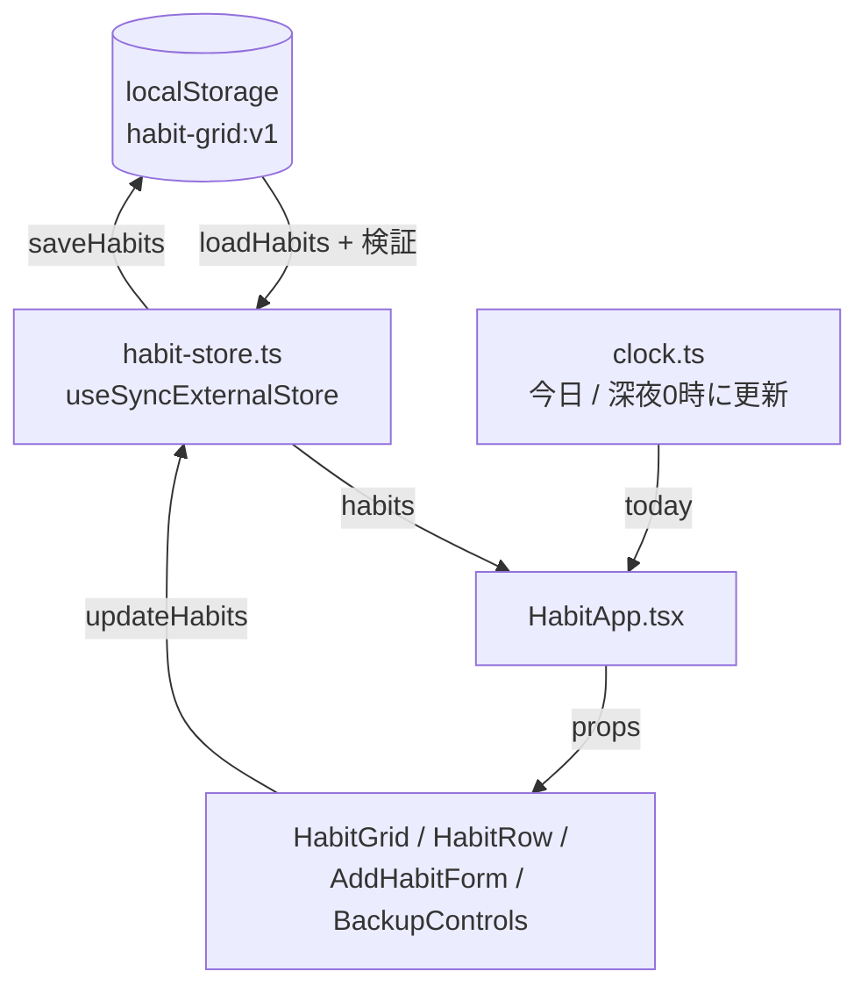

# Habit Grid — プロジェクト概要と振り返り

作成: 2026-08-06

しばらく触っていない状態から再開するときに、これを読めば思い出せることを目的にした文書。
使い方・構造・「なぜそう作ったか」・注意点・次の一手をまとめてある。

---

## 1. これは何か

毎日の習慣を GitHub の contribution graph 風のグリッドで記録するトラッカー。

- **バックエンドなし。** データはブラウザの `localStorage` にだけ入る
- **サーバー処理なし。** 全ページ静的（ビルド結果は `○ (Static)`）
- Next.js 16 / React 19 / Tailwind CSS v4 / TypeScript / vitest

### できること

| 機能 | 説明 |
| --- | --- |
| 習慣の追加・削除 | 名前 + 5色から選択 |
| 今日の記録 | 一覧の丸ボタンをタップして達成／取り消し |
| 過去の編集 | 習慣タブに切り替えると、グリッドのセルを直接クリックできる |
| 全体ヒートマップ | 「すべて」タブ。その日に達成した習慣の割合を5段階の濃さで表示 |
| 統計 | 継続日数（現在／最長）、合計日数、直近30日の達成率 |
| ランキング | 今月の順位。達成日数／継続日数で切り替え、同率対応、先月比つき |
| バックアップ | JSON でエクスポート／インポート |
| PWA | ホーム画面に追加してスタンドアロン起動 |

---

## 2. 日常の使い方（iPhone）

**必ずホーム画面のアイコンから開く。** Safari のタブから使わない。

理由は2つ:

1. iOS ではホーム画面アプリと Safari で保存領域が分かれることがある。Safari で付けた記録が
   ホーム画面アプリ側に出てこない可能性がある
2. Safari のタブ経由だと、7日間開かなかったときに記録が削除される対象になる

**ときどきエクスポートする。** 画面下部の「バックアップ」→ エクスポートで JSON が落ちてくる。
これが唯一の保険。ブラウザのサイトデータを消す・ホーム画面アプリを削除する・端末を変える、
のいずれでも記録は消える。

**記録忘れの通知は「ショートカット」アプリ側で設定してある。** アプリには通知機能を実装して
いない（iOS の制約でサーバーが要るため）。手順と理由は [reminder.md](./reminder.md) に。

---

## 3. 構成

```
app/
  page.tsx                    Server Component。外枠だけ
  layout.tsx                  metadata / viewport / themeColor
  manifest.ts                 PWA マニフェスト
  icon.png, apple-icon.png    生成物（scripts/generate-icons.mjs）
  api/
    insight/route.ts          AI要約のサーバー関数。Groq API への中継専用。
                               GROQ_API_KEY はここにしか置かない
  components/
    HabitApp.tsx              状態を束ねるクライアントのルート
    HabitGrid.tsx             ヒートマップの描画
    HabitRow.tsx              習慣1行（今日のチェック + 統計）
    AddHabitForm.tsx          追加フォーム
    BackupControls.tsx        エクスポート／インポート
    HabitRanking.tsx          今月のランキング
    AIInsight.tsx             「今日のひとこと」カード
  lib/
    date.ts                   日付キーとグリッド生成
    habits.ts                 習慣モデルと継続日数などの純粋関数
    storage.ts                localStorage 読み書き + 検証
    habit-store.ts            習慣データの外部ストア
    clock.ts                  「今日」の外部ストア
    ranking.ts                月次の順位付けと先月比
    backup.ts                 JSON の書き出し・読み込み
    insight.ts                AI要約に送る集計値を組み立てる純粋関数（dates は含めない）
scripts/
  generate-icons.mjs          アイコン PNG を生成（依存ライブラリなし）
```

### データの流れ



ポイントは **localStorage を「Reactの外にある store」として扱っている**こと。
`useEffect` で state に写していないので、読み込み用・保存用の effect が存在しない。

AI要約だけは別経路: `AIInsight.tsx` がボタン操作を受けて `insight.ts` で集計値を作り、
`/api/insight` → Groq API と1往復するだけ。localStorage には結果のテキストだけを
その日のキャッシュとして書き戻す（`habit-grid:insight:YYYY-MM-DD`）。

### データの形

```ts
type Habit = {
  id: string          // crypto.randomUUID()。非セキュアな http では乱数にフォールバック
  name: string
  color: "green" | "blue" | "purple" | "amber" | "rose"
  createdAt: string   // "YYYY-MM-DD"
  dates: string[]     // 達成した日。"YYYY-MM-DD" の昇順
}
```

localStorage には `habit-grid:v1` というキーで `{ version: 1, habits: [...] }` の形で入る。
エクスポートする JSON も同じ形なので、インポートは同じ検証コードを通せる。

---

## 4. なぜそう作ったか（設計判断）

あとから「なんでこうなってるんだっけ」となりやすい箇所の記録。

### 日付は必ずローカル時刻の `YYYY-MM-DD` 文字列

`Date.toISOString()` は **UTC に変換される**ので、日本時間の朝は日付が1日ずれる。
JST は UTC+9 なので、**朝9時より前は UTC ではまだ前日**。
例: 8月6日 08:00 JST は UTC で 8月5日 23:00 → `toISOString().slice(0,10)` は `"2026-08-05"` を返す。
毎朝チェックを付けるアプリでこれをやると、前日の欄に記録されることになる。
そのため `toDateKey()` を自前で用意して、`getFullYear()` / `getMonth()` / `getDate()` から組み立てている。
**日付を扱うコードを足すときは、必ず `app/lib/date.ts` の関数を使うこと。**

### localStorage は `useSyncExternalStore` で読む

最初は `useEffect` で読み込んで `setState` していたが、Next.js 16 の lint
（`react-hooks/set-state-in-effect`）でエラーになった。effect の中で同期的に setState すると
再レンダリングが連鎖するため。localStorage は「外部システム」なので、
`useSyncExternalStore` で購読するのが本来の形。結果として effect が2つとも消えた。

### 「今日」も外部ストア

タブを開きっぱなしで日付が変わると「今日」がずれる問題への対処。
`clock.ts` が深夜0時にタイマーで更新し、**さらにタブが再表示されたときにも時計を読み直す**。
マシンがスリープしていると `setTimeout` が発火しないことがあるため、両方必要。

### hydration が終わるまで `today` は `null`

サーバーとクライアントで時計・タイムゾーンが違うと hydration mismatch になる。
そのため最初のレンダリングではスケルトンを出し、クライアント側で確定してから中身を描く。

### 保存データは読み込み時に検証する

localStorage はユーザーが自由に書き換えられるし、古いバージョンのデータが残っていることもある。
`storage.ts` の `parseState()` が形をチェックして、壊れたエントリは捨てる。
インポートしたファイルも同じ関数を通すので、変な JSON を食わせても壊れない。

### Tailwind の色クラスは全部べた書き

Tailwind はソースを文字列として走査するので、`` `bg-${color}-500` `` のような動的生成は
CSS に出力されない。`app/lib/colors.ts` に全パターンを literal で書いてあるのはそのため。

### アイコンはコードから生成

`scripts/generate-icons.mjs` が `node:zlib` だけで PNG を書き出している。
画像ライブラリを入れずに済み、手で編集するバイナリ資産も持たない。
デザインを変えたいときはスクリプトを直して `pnpm icons`。

---

## 5. テスト

```bash
pnpm test        # 112件
```

| ファイル | 守っているもの |
| --- | --- |
| `date.test.ts` | ローカル時刻の日付キー、週の境界、グリッドの形、未来日の扱い |
| `habits.test.ts` | 継続日数（今日未チェックでも途切れない等）、最長記録、達成率 |
| `storage.test.ts` | 壊れたデータ・不正な色・重複日付を捨てること |
| `clock.test.ts` | 深夜0時のロールオーバー、タブ復帰時の追従（フェイクタイマー） |
| `backup.test.ts` | エクスポート／インポートの往復、壊れたファイルの拒否 |
| `ranking.test.ts` | 同率の順位、期間に対する割合、先月比、今月作成の扱い |
| `HabitApp.test.tsx` | 追加 → チェック → 永続化 → 削除、グリッドの編集可否 |
| `AddHabitForm.test.tsx` | 入力・色選択・送信 |
| `BackupControls.test.tsx` | ダウンロード、確認ダイアログ、エラー表示 |

継続日数まわりは仕様が微妙（今日チェックしていなくても昨日までの記録は生きている）なので、
挙動を変えるときは `habits.test.ts` の期待値を先に確認すること。

---

## 6. デプロイ

- 本番: https://habit-grid-9yb4.vercel.app
- **GitHub にプッシュすると Vercel が自動でビルド・公開する。** Vercel 側の操作は不要
- プラン: **Hobby（無料）**。サーバー関数もDBも使っていないので、無料枠を消費しない
  - Hobby は上限を超えても課金されず、停止するだけ。有料化は手動アップグレードが必要
- リポジトリ: `yuko0209/habit-grid`（public）
- push すると GitHub Actions（`.github/workflows/ci.yml`）で lint / 型チェック / テスト /
  ビルド / アイコンの差分確認が走る

```bash
git add -A
git commit -m "..."
git push          # → 1〜2分で本番に反映
```

---

## 7. 注意点

**localStorage はオリジン（ドメイン+ポート）ごとに分かれる。**
`http://localhost:3000` と本番URLでは記録が共有されない。開発中に付けた記録は本番に出てこないし、
その逆もない。移したいときはエクスポート／インポートを使う。

**バックアップが唯一の保険。** サイトデータの削除、ホーム画面アプリの削除、端末変更で記録は消える。

**複数端末で同期はできない。** localStorage 構成の必然。同期したければバックエンドが要る（下記）。

---

## 8. 次にやるとしたら

手をつけやすい順:

1. **習慣の並べ替え・名前の編集** — いまは追加順で固定、名前も変更できない
2. **記録の一括操作** — 「昨日の分をまとめて付ける」など。旅行明けに欲しくなるはず
3. **週次・月次のサマリー** — 「今週 5/7 達成」のような表示
4. **リマインダー通知** — いまは iOS の「ショートカット」アプリで代用している（[reminder.md](./reminder.md)）。
   アプリ側で実装するなら Web Push になるが、iOS には時刻指定のローカル通知がないため
   push を送るサーバーが要る。Service Worker + VAPID 鍵 + 購読情報の保管場所 + 定期実行の
   4点セットが必要で、「バックエンドなし・全ページ静的」という前提が崩れる。
   Vercel Hobby の Cron は1日1回・指定時刻から1時間以内の精度なので、そこも要検討。
   やる価値が出るのは「未記録の日だけ鳴らす」が欲しくなったとき
5. **複数端末での同期** — ここだけは設計が変わる。Supabase などを足して
   `habit-store.ts` の裏側を差し替える形になる。UI とロジック（`lib/habits.ts`）は
   そのまま使えるはずで、`storage.ts` / `habit-store.ts` の2ファイルが交換対象

いずれの場合も、`app/lib/` の純粋関数にはテストがあるので、そこを壊していないかは
`pnpm test` ですぐ分かる。

---

## 9. よく使うコマンド

```bash
pnpm dev          # 開発サーバー http://localhost:3000
pnpm test         # テスト
pnpm test:watch   # 監視モード
pnpm lint         # ESLint
pnpm build        # 本番ビルド（デプロイ前の確認用）
pnpm icons        # アイコン PNG の再生成
```

`AGENTS.md` は `next dev` が自動生成・再生成するファイルなので、消しても復活する。
コミットに含めておけば差分が出ない。
## 6. デプロイ

- 本番: https://habit-grid-9yb4.vercel.app
- **GitHub にプッシュすると Vercel が自動でビルド・公開する。** Vercel 側の操作は不要
- プラン: **Hobby（無料）**。DBは使っていない。サーバー関数は `/api/insight` の1つだけで、
  呼び出し頻度も低いので無料枠には余裕がある
  - Hobby は上限を超えても課金されず、停止するだけ。有料化は手動アップグレードが必要
- **環境変数 `GROQ_API_KEY` が必要。** ローカルは `.env.local`、本番は Vercel の
  Project Settings → Environment Variables に同じ値を登録する（両方に設定しないと
  AI要約だけ動かない状態になる）
- リポジトリ: `yuko0209/habit-grid`（public）
- push すると GitHub Actions（`.github/workflows/ci.yml`）で lint / 型チェック / テスト /
  ビルド / アイコンの差分確認が走る

```bash
git add -A
git commit -m "..."
git push          # → 1〜2分で本番に反映
```

---

## 7. 注意点

**localStorage はオリジン（ドメイン+ポート）ごとに分かれる。**
`http://localhost:3000` と本番URLでは記録が共有されない。開発中に付けた記録は本番に出てこないし、
その逆もない。移したいときはエクスポート／インポートを使う。

**バックアップが唯一の保険。** サイトデータの削除、ホーム画面アプリの削除、端末変更で記録は消える。

**複数端末で同期はできない。** localStorage 構成の必然。同期したければバックエンドが要る（下記）。

---

## 8. 次にやるとしたら

手をつけやすい順:

1. **習慣の並べ替え・名前の編集** — いまは追加順で固定、名前も変更できない
2. **記録の一括操作** — 「昨日の分をまとめて付ける」など。旅行明けに欲しくなるはず
3. **週次・月次のサマリー** — 「今週 5/7 達成」のような表示
4. **リマインダー通知** — いまは iOS の「ショートカット」アプリで代用している（[reminder.md](./reminder.md)）。
   アプリ側で実装するなら Web Push になるが、iOS には時刻指定のローカル通知がないため
   push を送るサーバーが要る。Service Worker + VAPID 鍵 + 購読情報の保管場所 + 定期実行の
   4点セットが必要で、「バックエンドなし・全ページ静的」という前提が崩れる。
   Vercel Hobby の Cron は1日1回・指定時刻から1時間以内の精度なので、そこも要検討。
   やる価値が出るのは「未記録の日だけ鳴らす」が欲しくなったとき
5. **複数端末での同期** — ここだけは設計が変わる。Supabase などを足して
   `habit-store.ts` の裏側を差し替える形になる。UI とロジック（`lib/habits.ts`）は
   そのまま使えるはずで、`storage.ts` / `habit-store.ts` の2ファイルが交換対象
6. **`/api/insight` の乱用対策** — 今は誰でも叩ける状態。個人利用の範囲では実害は薄いが、
   デモURLがどこかで広まった場合、Groq の無料枠の上限に達して自分が使えなくなるのが
   一番あり得るリスク。気になったら Vercel の Firewall でのレート制限を検討する

いずれの場合も、`app/lib/` の純粋関数にはテストがあるので、そこを壊していないかは
`pnpm test` ですぐ分かる。

---

## 9. よく使うコマンド

```bash
pnpm dev          # 開発サーバー http://localhost:3000
pnpm test         # テスト
pnpm test:watch   # 監視モード
pnpm lint         # ESLint
pnpm build        # 本番ビルド（デプロイ前の確認用）
pnpm icons        # アイコン PNG の再生成
```

`AGENTS.md` は `next dev` が自動生成・再生成するファイルなので、消しても復活する。
コミットに含めておけば差分が出ない。
